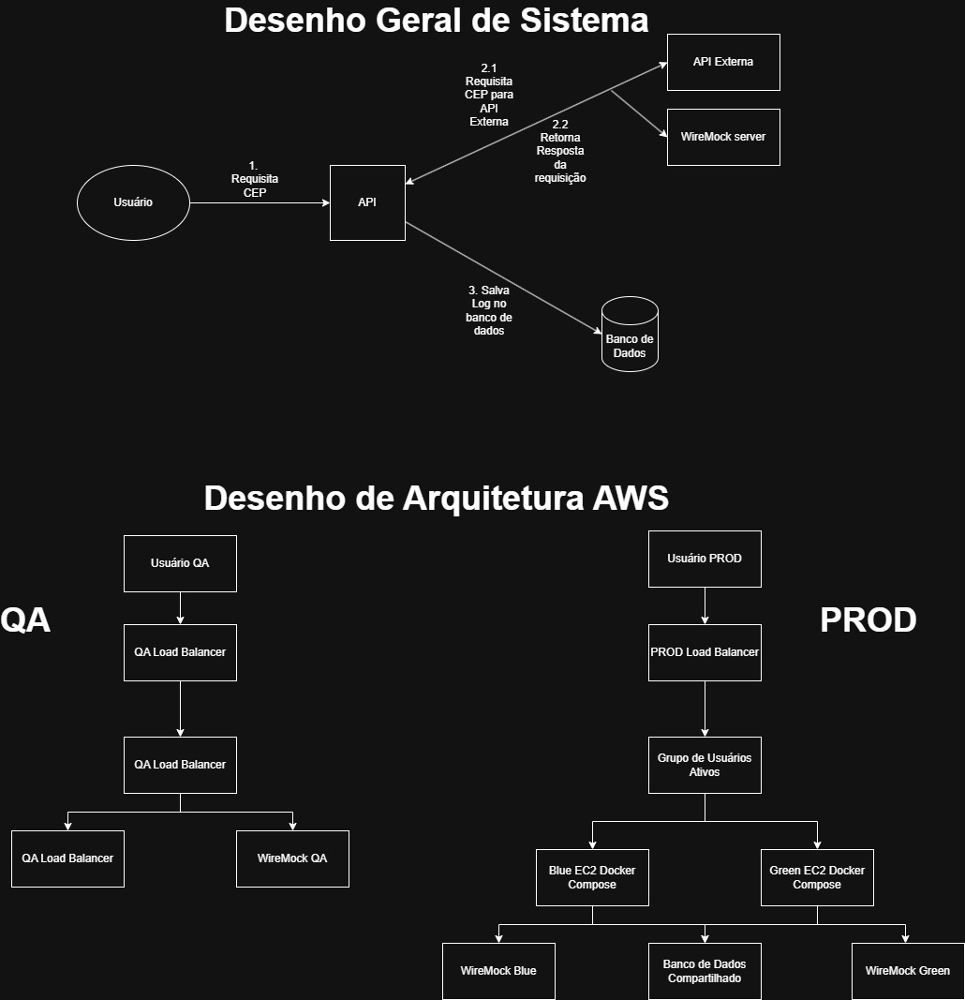

# Teste Técnico API CEP - Desafio

**Projeto realizado como parte da avaliação técnica para vaga de Engenheiro de Software Sênior - Nava Santander.**  
Solução feita usando Spring Boot, Java 17, WireMock, HSQLDB, AWS e Terraform
---

## Desenho Técnico


## Setup da Aplicação
## Local (É possível rodar a aplicação da linha de comando, sem a necessidade de uma IDE)
### Download do Projeto
```bash
git clone https://github.com/cmsulzbeck/demo_api_cep.git demo
cd demo
```

## Verificar requisitos Maven e Java
```bash
java -version
.\mvnw -version
```

## Setup Local do Projeto  
Instalar dependências locais
```bash
.\mvnw dependency:copy-dependencies
.\mvnw dependency:copy "-Dartifact=org.wiremock:wiremock-standalone:3.13.2" "-DoutputDirectory=target"
```

Terminal 1: iniciar Banco de Dados (HSQLDB)
```bash
java -cp "target/dependency/*" org.hsqldb.server.Server --database.0 file:./data/demo-db --dbname.0 demo
```

Terminal 2: Iniciar Servidor WireMock
```bash
java -jar target/wiremock-standalone-3.13.2.jar --port 8089 --root-dir src/test/resources/wiremock
```

Terminal 3 (ou IDE): Inicializar API
```bash
.\mvnw spring-boot:run
```

## Testar chamada para API Local
A API tem apenas um endpoint:  
* `GET /cep/{cep}`  

Caso bem sucedido
```bash
Invoke-RestMethod http://localhost:8080/cep/05351000
```
Resposta:
```json
{
  "cep": "05351000",
  "streetName": "Avenida Doutor Cândido Motta Filho",
  "district": "Cidade São Francisco",
  "uf": "SP"
}
```

Caso de Erro
```bash
Invoke-RestMethod http://localhost:8080/cep/00000000
```
Resposta:
```json
{
  "message": "External CEP API returned an error",
  "timeStamp": "2026-06-24T20:36:49.173156869",
  "status": 404,
  "path": "/cep/00000000",
  "externalResponse": "{\"code\":\"CEP_NOT_FOUND\",\"message\":\"CEP was not found in the mocked external API\"}"
}
```  

## Containerização
Com docker rodando  
Build da imagem Docker
```bash
docker build -t api-cep:local .
```

Iniciar a stack completa localmente
```bash
docker compose up --build
```

### Testar chamada para API Containerizada
Caso bem sucedido
```bash
Invoke-RestMethod http://localhost:8080/cep/05351000
```
Resposta:
```json
{
  "cep": "05351000",
  "streetName": "Avenida Doutor Cândido Motta Filho",
  "district": "Cidade São Francisco",
  "uf": "SP"
}
```

Caso de Erro
```bash
Invoke-RestMethod http://localhost:8080/cep/00000000
```
Resposta:
```json
{
  "message": "External CEP API returned an error",
  "timeStamp": "2026-06-24T20:36:49.173156869",
  "status": 404,
  "path": "/cep/00000000",
  "externalResponse": "{\"code\":\"CEP_NOT_FOUND\",\"message\":\"CEP was not found in the mocked external API\"}"
}
```

Visualizar Banco de Dados Local Docker
```bash
java -cp "target/dependency/*" org.hsqldb.util.DatabaseManagerSwing
```
Dados para conexão
```text
Type: HSQL Database Engine Server
Driver: org.hsqldb.jdbc.JDBCDriver
URL: jdbc:hsqldb:hsql://localhost/demo
User: SA
Password:
```

Consultar tabela LOG
```sql
SELECT * FROM LOG
```
Resultado:

| ID  | CALL_TIME                  | OPERATION_TYPE | REQUEST_DATA | RETURNED_DATA                                                                                                                                                                                                                                   | STATUS_CODE |
|-----|----------------------------|----------------|--------------|-------------------------------------------------------------------------------------------------------------------------------------------------------------------------------------------------------------------------------------------------|-------------|
| 1   | 2026-06-24 19:54:03.783933 | GET            |              | {"message":"External CEP API returned an error","timeStamp":"2026-06-24T19:54:03.688972137","status":404,"path":"/cep/00000000","externalResponse":"{\"code\":\"CEP_NOT_FOUND\",\"message\":\"CEP was not found in the mocked external API\"}"} | 404         |
| 2   | 2026-06-24 19:54:10.700397 | GET            |              | {"cep":"05351000","streetName":"Avenida Doutor Cândido Motta Filho","district":"Cidade São Francisco","uf":"SP"}                                                                                                                                | 200         |

## Setup Server QA
Verificar ferramentas necessárias
```bash
terraform -version
aws --version
docker version
```

Configurar AWS
```bash
aws configure
```
OBS: Seu usuário IAM deve ter as seguintes permissões (concedidas no site da AWS)
```text
AmazonEC2FullAccess
AmazonVPCFullAccess
ElasticLoadBalancingFullAccess
IAMFullAccess
AmazonSSMFullAccess
```

Criar uma chave-par EC2, caso não possua
```bash
cd C:\Users\cmsulzbeck\source\repos\demo

aws ec2 create-key-pair `
  --key-name api-cep-demo `
  --query "KeyMaterial" `
  --output text > api-cep-demo.pem
```

Recupere o IP Público
```bash
Invoke-RestMethod https://checkip.amazonaws.com
```

Construir e puxar uma imagem que o EC2 consiga visualizar
```bash
docker login
docker build -t <your-dockerhub-user>/api-cep:qa .
docker push <your-dockerhub-user>/api-cep:qa
```

Criar tfvars de QA
```bash
Copy-Item infra/terraform/envs/qa/terraform.tfvars.example infra/terraform/envs/qa/terraform.tfvars

notepad infra/terraform/envs/qa/terraform.tfvars
```

Setar valores necessários (allowed_ssh_cidrs)
```text
aws_region = "us-east-1"

api_image = "<your-dockerhub-user>/api-cep:qa"

allowed_http_cidrs = ["0.0.0.0/0"]
allowed_ssh_cidrs  = ["YOUR_PUBLIC_IP/32"]

key_name = "api-cep-demo"

database_username = "SA"
database_password = ""
```

Deploy QA (Terraform irá printar valores de DNS e IP público)
```bash
cd infra/terraform/envs/qa

terraform init
terraform plan
terraform apply
```

## Testar chamada para API no servidor QA
Printar DNS (Caso terraform não printe por conta)
```bash
terraform output alb_dns_name
```

Chamada de API com url do servidor de QA
```bash
Invoke-RestMethod http://<alb_dns_name>/cep/05351000
```